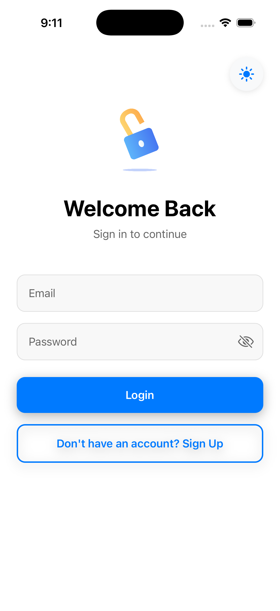
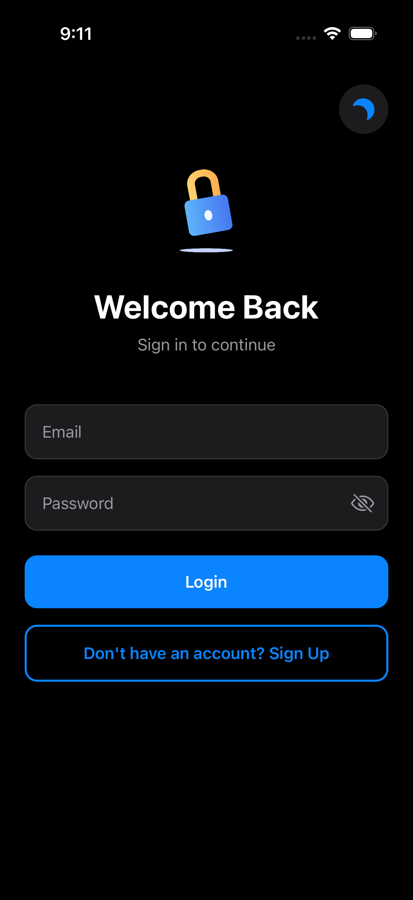
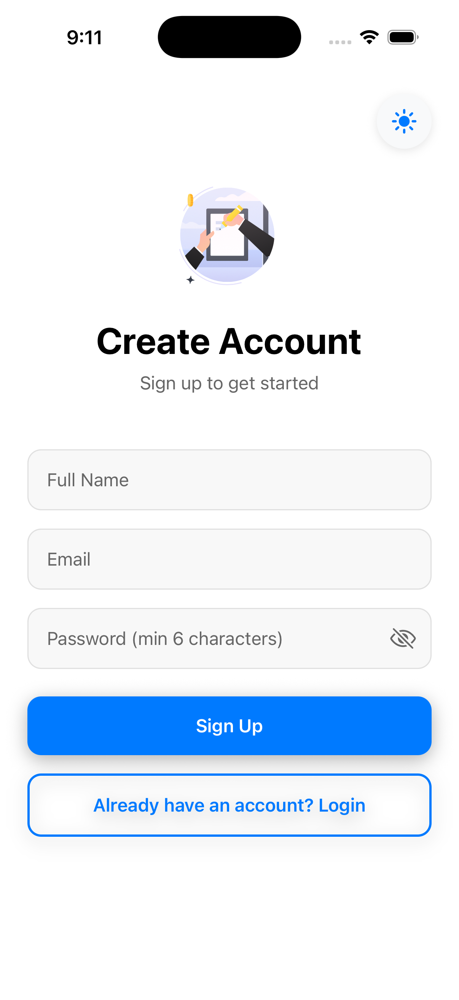
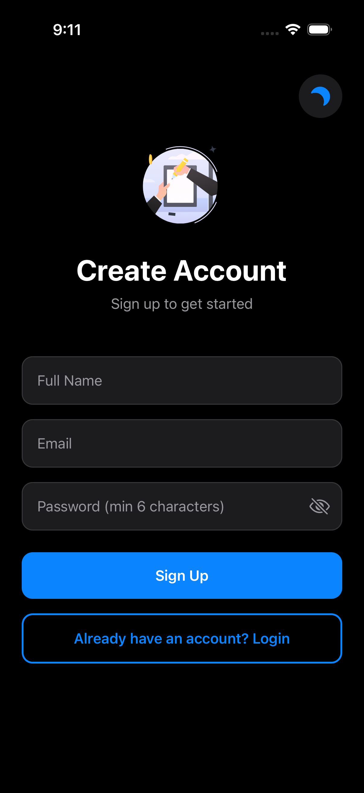
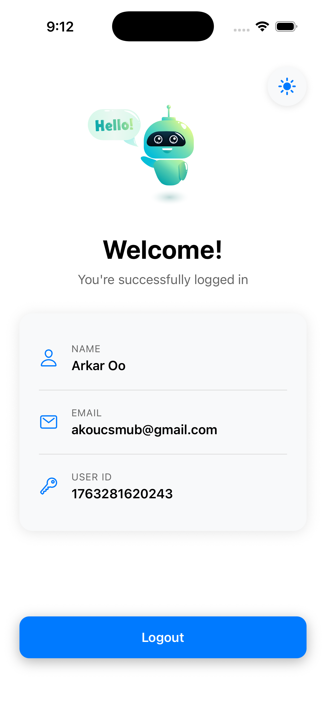

# 🔐 User Authentication App

A modern, production-ready React Native authentication app built with **Expo**, **TypeScript**, **Feature-Based Architecture**, and **Light/Dark Mode** support.


## ✨ Features

### Core Features

- ✅ **Complete Authentication Flow** - Login, Signup, and Logout
- ✅ **Light/Dark Mode** - System-aware theme with manual toggle
- ✅ **React Context API** - Separate contexts for Auth and Theme
- ✅ **Persistent Authentication** - AsyncStorage integration
- ✅ **React Hook Form** - Efficient form handling
- ✅ **Zod Validation** - Type-safe schema validation
- ✅ **Password Toggle** - Eye icon to show/hide password
- ✅ **Smooth Animations** - React Native Reanimated

### Architecture Features

- ✅ **Feature-Based Architecture** - Organized by domain, not by type
- ✅ **TypeScript** - Full type safety
- ✅ **Clean Code** - Separation of concerns
- ✅ **Reusable Components** - Shared component library
- ✅ **Service Layer** - Business logic separated from UI
- ✅ **Comprehensive Tests** - Jest & React Testing Library
- ✅ **Performance Optimized** - useCallback, memoization

## 📱 Screenshots








### Light Mode

[Add light mode screenshots]

### Dark Mode

[Add dark mode screenshots]

## 🚀 Quick Start

### Prerequisites

- Node.js (v18 or higher)
- npm or yarn
- Expo CLI
- iOS Simulator (Mac) or Android Emulator

### Installation

1. **Clone the repository**

```bash
git clone https://github.com/arkar-00/UserAuthApp.git
cd UserAuthApp
```

2. **Install dependencies**

```bash
npm install
```

3. **Start the development server**

```bash
npx expo start
```

4. **Run on your device**

Press:

- `i` - Open iOS simulator
- `a` - Open Android emulator
- Scan QR code with Expo Go app on your phone

## 📁 Feature-Based Project Structure

```
src/
├── features/                 # Feature modules
│   ├── auth/                # Authentication feature
│   │   ├── components/      # Auth-specific components
│   │   │   ├── LoginForm.tsx
│   │   │   ├── SignupForm.tsx
│   │   ├── context/         # Auth context
│   │   │   └── AuthContext.tsx
│   │   ├── hooks/           # Auth hooks
│   │   │   └── useAuth.ts
│   │   ├── screens/         # Auth screens
│   │   │   ├── LoginScreen.tsx
│   │   │   ├── SignupScreen.tsx
│   │   │   └── index.ts
│   │   ├── services/        # Auth business logic
│   │   │   └── auth.service.ts
│   │   ├── types/           # Auth types
│   │   │   └── auth.types.ts
│   │   ├── utils/           # Auth utilities
│   │   │   └── validation.schemas.ts
│   │   └── __tests__/       # Auth tests
│   │       └── auth.test.tsx
│   ├── home/                # Home feature
│   │   ├── components/
│   │   │   ├── UserCard.tsx
│   │   │   └── UserInfo.tsx
│   │   ├── screens/
│   │   │   └── HomeScreen.tsx
│   │   └── __tests__/
│   └── theme/               # Theme feature
│       ├── components/
│       │   └── ThemeToggle.tsx
│       ├── context/
│       │   └── ThemeContext.tsx
│       ├── hooks/
│       │   └── useTheme.ts
│       ├── constants/
│       │   ├── colors.ts
│       │   └── theme.ts
│       └── types/
│           └── theme.types.ts
├── shared/                  # Shared across features
│   ├── components/          # Reusable components
│   │   ├── Button.tsx
│   │   ├── Input.tsx
│   │   ├── PasswordInput.tsx
│   │   └── LoadingSpinner.tsx
│   ├── services/            # Shared services
│   │   └── storage.service.ts
│   └── types/               # Shared types
│       └── common.types.ts
├── navigation/              # Navigation setup
│   ├── AppNavigator.tsx
│   └── types.ts
└── config/                  # App configuration
    └── constants.ts
```

## 🎨 Theme System

### Light Mode Colors

```typescript
{
  primary: '#007AFF',
  background: '#FFFFFF',
  card: '#F8F9FA',
  text: '#000000',
  textSecondary: '#666666',
  border: '#E0E0E0',
  error: '#FF3B30',
  success: '#34C759',
  inputBackground: '#F8F8F8',
}
```

### Dark Mode Colors

```typescript
{
  primary: '#0A84FF',
  background: '#000000',
  card: '#1C1C1E',
  text: '#FFFFFF',
  textSecondary: '#98989D',
  border: '#38383A',
  error: '#FF453A',
  success: '#32D74B',
  inputBackground: '#1C1C1E',
}
```

### Using Theme in Components

```typescript
import { useTheme } from '../features/theme/hooks/useTheme'

const MyComponent = () => {
  const { theme, isDark, toggleTheme } = useTheme()

  return (
    <View style={{ backgroundColor: theme.colors.background }}>
      <Text style={{ color: theme.colors.text }}>Hello</Text>
    </View>
  )
}
```

## 🏗️ Architecture Patterns

### Feature-Based Architecture

Each feature is **self-contained** with its own:

- Components
- Context/State
- Hooks
- Screens
- Services
- Types
- Tests

**Benefits:**

- ✅ Easy to understand and navigate
- ✅ Features can be developed independently
- ✅ Easy to add/remove features
- ✅ Clear separation of concerns
- ✅ Scalable for large teams

### Service Layer Pattern

Business logic is separated into services:

```typescript
// auth.service.ts
export const authService = {
  async login(data: LoginFormData): Promise<User> {
    // Business logic here
  },
  async signup(data: SignupFormData): Promise<User> {
    // Business logic here
  },
}
```

### Context + Hooks Pattern

State management uses Context + Custom Hooks:

```typescript
// AuthContext.tsx - State definition
export const AuthContext = createContext<AuthContextType | undefined>(undefined)

// useAuth.ts - Hook for consuming
export const useAuth = () => {
  const context = useContext(AuthContext)
  if (!context) throw new Error('useAuth must be used within AuthProvider')
  return context
}
```

## 🧪 Testing

Run all tests:

```bash
npm test
```

Run tests in watch mode:

```bash
npm test -- --watch
```

Run tests with coverage:

```bash
npm test -- --coverage
```

### Test Structure

Tests are co-located with features:

```
src/features/auth/__tests__/auth.test.tsx
src/features/home/__tests__/home.test.tsx
```

## 🎯 Key Features Breakdown

### 1. Light/Dark Mode

**Automatic Detection:**

- Detects system theme on app launch
- Respects user's device settings

**Manual Toggle:**

- Theme toggle button on all screens
- Animated theme switching
- Persisted preference

**Theme-Aware Components:**

- All components respect current theme
- Dynamic colors based on theme mode
- Smooth transitions

### 2. Feature-Based Architecture

**Auth Feature:**

- Self-contained authentication module
- Login/Signup forms as components
- Auth service for business logic
- Validation schemas
- Type definitions

**Home Feature:**

- User profile display
- Reusable user info components
- Themed UI elements

**Theme Feature:**

- Theme management system
- Theme toggle component
- Color constants
- Theme context and hooks

### 3. Shared Components

**Reusable across all features:**

- Button (Primary/Secondary variants)
- Input (Themed, with error handling)
- LoadingSpinner (Themed)

**Theme Integration:**

- All shared components use `useTheme` hook
- Automatically adapt to theme changes

## 📦 Dependencies

### Core

- `expo` - Expo framework
- `react` - React library
- `react-native` - React Native framework
- `typescript` - TypeScript

### Navigation

- `@react-navigation/native` - Navigation library
- `@react-navigation/native-stack` - Stack navigator
- `react-native-screens` - Native screens
- `react-native-safe-area-context` - Safe area support

### Form & Validation

- `react-hook-form` - Form management
- `zod` - Schema validation
- `@hookform/resolvers` - Form resolvers

### Storage

- `@react-native-async-storage/async-storage` - Persistent storage

### Animation

- `react-native-reanimated` - Animation library

### UI

- `@expo/vector-icons` - Icon library

### Testing

- `jest` - Testing framework
- `@testing-library/react-native` - Testing utilities
- `@testing-library/jest-native` - Jest matchers

## 🔧 Configuration

### Theme Persistence

Theme preference is automatically saved to AsyncStorage:

```typescript
const THEME_KEY = '@theme_mode'
```

### System Theme Detection

App automatically detects system theme:

```typescript
const systemColorScheme = useColorScheme() // 'light' | 'dark'
```

## 🎨 Customization Guide

### Adding a New Feature

1. Create feature folder:

```bash
mkdir -p src/features/newFeature/{components,screens,hooks,types}
```

2. Add feature components, hooks, etc.

3. Export from feature:

```typescript
// src/features/newFeature/index.ts
export { NewFeatureScreen } from './screens/NewFeatureScreen'
export { useNewFeature } from './hooks/useNewFeature'
```

### Customizing Theme Colors

Edit `src/features/theme/constants/colors.ts`:

```typescript
export const lightColors: ThemeColors = {
  primary: '#YOUR_COLOR', // Change primary color
  // ... other colors
}
```

### Adding New Validation Rules

Edit `src/features/auth/utils/validation.schemas.ts`:

```typescript
export const signupSchema = z.object({
  password: z
    .string()
    .min(8, 'Password must be at least 8 characters')
    .regex(/[A-Z]/, 'Must contain uppercase letter'),
})
```

## 🚀 Building for Production

### Configure EAS

```bash
eas build:configure
```

### Build Commands

```bash
# iOS
eas build --platform ios

# Android
eas build --platform android

# Both
eas build --platform all
```

## 🐛 Troubleshooting

### Theme Not Persisting

Clear AsyncStorage:

```bash
# In app
await AsyncStorage.clear();
```

### Navigation Theme Not Updating

Make sure NavigationContainer has theme prop:

```typescript
<NavigationContainer theme={navigationTheme}>
```

### Common Issues

See [Troubleshooting Guide](./docs/TROUBLESHOOTING.md)

## 🤝 Contributing

1. Fork the repository
2. Create feature branch (`git checkout -b feature/AmazingFeature`)
3. Follow feature-based architecture
4. Add tests for new features
5. Commit changes (`git commit -m 'Add AmazingFeature'`)
6. Push to branch (`git push origin feature/AmazingFeature`)
7. Open Pull Request

## 📄 License

This project is licensed under the MIT License - see the [LICENSE](LICENSE) file for details.

## 👨‍💻 Author

Your Name

- GitHub: [@yourusername](https://github.com/arkar-00)
- LinkedIn: [Your Name](https://linkedin.com/in/yourprofile)

## 🙏 Acknowledgments

- [Expo](https://expo.dev/)
- [React Navigation](https://reactnavigation.org/)
- [React Hook Form](https://react-hook-form.com/)
- [Zod](https://zod.dev/)

## 📚 Learning Resources

- [Expo Documentation](https://docs.expo.dev/)
- [React Native Documentation](https://reactnative.dev/)
- [Feature-Based Architecture](https://khalilstemmler.com/articles/software-design-architecture/feature-sliced/)
- [React Hook Form Documentation](https://react-hook-form.com/get-started)

---

Made with ❤️ using Expo, TypeScript, and Feature-Based Architecture
